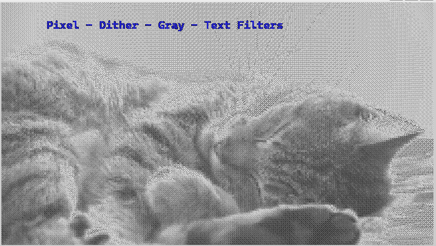

# Filter Pipeline Framework

# Filter Pipeline Framework

## Overview

The **Filter Pipeline Framework** is a modular system designed to process video or image streams using a sequence of calculators. Each calculator performs specific tasks on the data, such as grayscale conversion, dithering, pixelation, or applying overlays. The framework is built around a central **Scheduler** that manages calculators and their associated contexts, ensuring smooth execution and data flow.

This document provides a detailed explanation of the framework's components and the programming concepts it employs.

---

## Core Components and Programming Concepts

The framework demonstrates the use of the following core programming concepts:

### 1. Inheritance

**Purpose**: The framework leverages inheritance to create a hierarchy of calculators derived from the abstract base class `CalculatorBase`.

**Example**:
- `GrayscaleCalculator`, `PixelShapeCalculator`, and `DitherCalculator` all inherit from `CalculatorBase` and implement their unique functionality while adhering to the common lifecycle interface (`enter`, `process`, `close`).

---

### 2. Polymorphism

**Purpose**: The `Scheduler` uses polymorphism to manage calculators. It stores pointers to `CalculatorBase` objects and invokes their methods without needing to know their concrete types.

**Example**:
- The `Scheduler` iterates over a collection of calculators, calling `process` for each, allowing them to operate independently based on their specific logic.

---
### 3. Text File I/O

**Purpose**: Handles reading and writing image data to and from files using file I/O operations.

**Example**:
- The `ImageUtils` class includes methods like `readBMP` and `writeBMP` to read BMP images from files and write processed images back to files. These methods utilize file streams to handle raw image data and convert it into the framework's `Image` class for further processing.

---

### 4. Exceptions

**Purpose**: Ensures robustness by handling errors gracefully through custom exceptions.

**Example**:
- `CalculatorException` and `PortException` are used to manage errors related to calculator operations and port data flow, respectively.

---

### 5. Overloaded Operator

**Purpose**: Simplifies logging and debugging by overloading the `<<` operator for structured output.

**Example**:
- The `<<` operator is used to output formatted information about objects like `Image` or `Packet`.

---

### 6. Abstract Class

**Purpose**: Defines a consistent interface for all calculators through the abstract class `CalculatorBase`.

**Example**:
- The `CalculatorBase` class mandates the implementation of the `enter`, `process`, and `close` methods, ensuring a consistent structure for all derived calculators.

---

### 7. A Data Structure with an Iterator

**Purpose**: Implements custom data structures with iterators for managing pipeline components.

**Example**:
- The `Port` class manages a queue of `Packet`s, enabling sequential data flow between calculators and uses iterator to find a queue name.

---

### 8. A Data Structure from the C++ Standard Template Library (STL)

**Purpose**: Utilizes STL containers for efficient data management.

**Example**:
- `std::map` is used in `CalculatorContext` to manage input ports, output ports, and side packets. This ensures efficient lookups and storage of configuration data.

---

## Summary

The **Filter Pipeline Framework** uses:
- **Inheritance** and **Polymorphism** for modular design.
- **Text File I/O** for dynamic configuration.
- **Exceptions** for robust error handling.
- **Overloaded Operators** for enhanced debugging.
- **Abstract Classes** for enforcing consistency in component design.
- **Custom Data Structures with Iterators** for controlled data flow.
- **STL Containers (e.g., `map`)** for efficient management of configuration and port data.

## Framework Workflow

### Calculator Registration
- Each calculator is derived from `CalculatorBase`.
- Calculators define their input/output ports and specific processing logic.
- The `Scheduler` registers calculators and retrieves their contexts.

### Data Flow
- Input data is fed into the pipeline through the **Input Callback**.
- The `Scheduler` passes data between calculators using their `process` methods.
- Processed data is output via the **Output Callback**.

### Time Management
- The `Scheduler` calculates delta time to measure elapsed time between frames.
- Ensures fair processing time for each calculator by enforcing a frame rate.

---

## Example Usage

### Setting Up the Pipeline

#### Create Calculators
- Implement custom calculators by deriving from `CalculatorBase` and overriding `enter`, `process`, and `close`.

#### Register Calculators
- Add calculators to the `Scheduler` and configure their contexts with side packets and ports.

#### Configure Callbacks
- Provide input and output callbacks to handle data flow.

#### Run the Scheduler
- The `Scheduler` processes frames in real-time, invoking calculators sequentially.

---

## Example Code

### Calculator Implementation
```cpp
class GrayscaleCalculator : public CalculatorBase {
public:
    GrayscaleCalculator() : CalculatorBase("GrayscaleCalculator") {}

    void enter(CalculatorContext* cc, float delta) override {}
    void process(CalculatorContext* cc, float delta) override {
        Port& inputPort = cc->getInputPort("ImageInput");
        if (inputPort.size() == 0) return;

        Packet inputPacket = inputPort.read();
        Image image = inputPacket.get<Image>();
        // Convert image to grayscale...
        cc->getOutputPort("ImageOutput").write(Packet(std::move(image)));
    }
    void close(CalculatorContext* cc, float delta) override {}
};


int main(){
    Scheduler scheduler;

    GrayscaleCalculator grayscaleCalculator;
    scheduler.registerCalculator(&grayscaleCalculator);

    scheduler.registerInputCallback([](void* ctx) -> Packet {
        // Callback to read input data
        return Packet(Image(...));
    }, nullptr);

    scheduler.registerOutputCallback([](const Packet& packet) {
        // Handle processed output data
    });
    scheduler.connectCalculators();
    while(true){
        scheduler.run();
    }

}

```
## Example Usage

A complete example demonstrating how to decode video frames from an MP4 file and pass them as a stream of bytes is available in the `examples` folder.

---

### Running the Example

1. Navigate to the `examples` folder.
2. Run the provided script:

   ```sh
   ./scripts/main_video_stream_filter.sh
   ```

3. This script:
   - Compiles the main entry point `mainStreamFilter.cpp`.
   - Uses the calculators in `scripts/calculators` to apply filters.
   - Streams the video frames with FFmpeg and processes them through the framework.

---

### Header Parsing
- Video or image metadata is parsed in the main entry and validated at the beginning.
- The header contains information like dimensions and pixel format, which are used to set up the framework for processing incoming data.

### Header Format

The video header is a simple string in the following format:

```sh
HEADER=$(cat <<EOF
VIDEO_STREAM_HEADER
WIDTH:$WIDTH
HEIGHT:$HEIGHT
PIX_FMT:$PIX_FMT
FPS:$FPS
DURATION:$DURATION
HEADER_END
EOF
)
```

This header provides essential information such as the frame dimensions and pixel format.

---

## Preview: Before and After

Below are examples of the video frames before and after processing through the pipeline:

### Original Frame (Before Processing)


### Processed Frame (After Applying Filters)


---


---

### Acknowledgments

This project was inspired by the architecture and design patterns used in [MediaPipe](https://github.com/google/mediapipe). No source code was copied, and this implementation was created independently based on publicly available concepts and ideas.


## Attributions

Video by Jake Heinemann from Pexels: [https://www.pexels.com/video/cute-cat-1481903/](https://www.pexels.com/video/cute-cat-1481903/)


